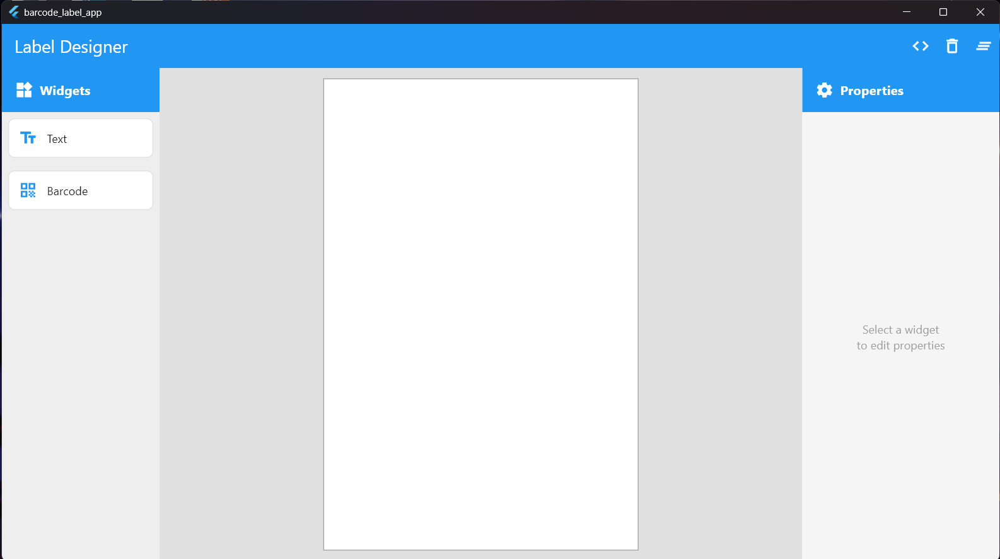
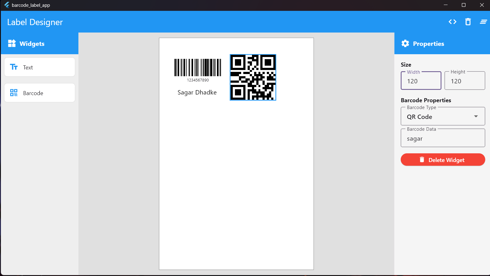
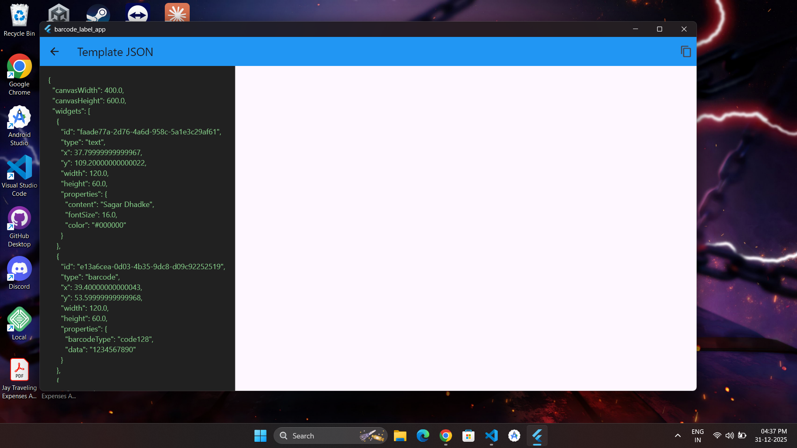

# 🏷️ Barcode Label Designer

A simple Flutter application for designing barcode labels with drag-and-drop functionality. Create custom labels with text and barcodes, and export designs as JSON.

## ✨ Features

- 🎯 **Drag & Drop Interface** - Easily add widgets to your canvas
- 📝 **Text Widgets** - Add and customize text elements
- 📊 **Barcode Support** - Generate Code 128 and QR codes
- ⚙️ **Property Editor** - Customize size, content, and appearance
- 📋 **JSON Export** - View and copy your design as JSON
- 🎨 **Visual Canvas** - Real-time preview of your label design

## 📸 Screenshots

### Main Editor Screen


### Drag & Drop


### JSON Viewer



## 🎮 How to Use

1. **Add Widgets**: Drag text or barcode widgets from the left panel onto the canvas
2. **Edit Properties**: Click a widget to select it, then edit its properties in the right panel
3. **Move Widgets**: Click and drag widgets to reposition them
4. **Resize**: Adjust width and height in the properties panel
5. **View JSON**: Click the code icon (`</>`) to see your design in JSON format
6. **Copy JSON**: Use the copy button to copy the JSON to clipboard

## 🛠️ Built With

- **Flutter** - UI Framework
- **Provider** - State Management
- **barcode_widget** - Barcode Generation
- **uuid** - Unique ID Generation

## 📦 Project Structure

```
lib/
├── main.dart                          # App entry point
├── models/
│   └── canvas_widget.dart             # Widget data model
├── provider/
│   └── design_provider.dart           # State management
├── screens/
│   ├── home_screen.dart               # Main editor screen
│   └── json_viewer_screen.dart        # JSON display screen
└── widgets/
    ├── canvas_area.dart               # Canvas widget
    ├── property_panel.dart            # Properties editor
    ├── widget_palette.dart            # Widget selection panel
    └── canvas_widgets/
        ├── text_widget.dart           # Text renderer
        └── barcode_widget.dart        # Barcode renderer
```